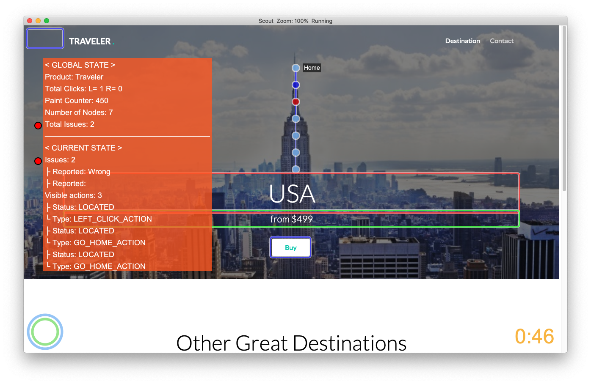
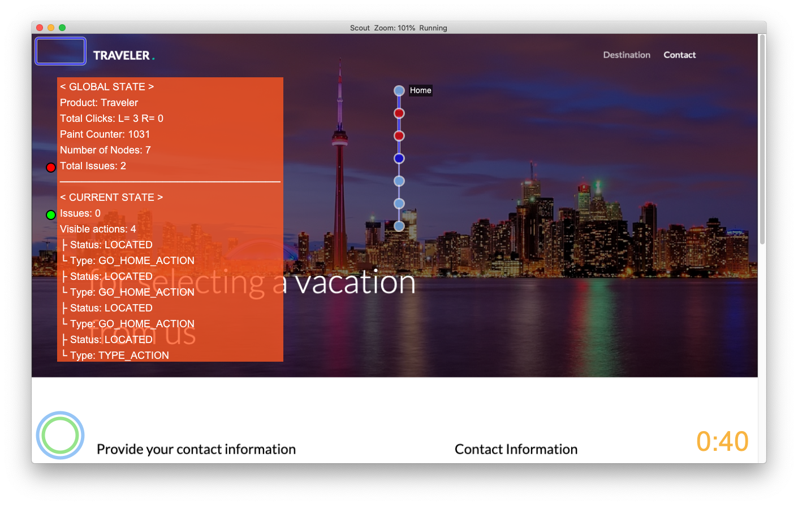

<!--
SPDX-FileCopyrightText: 2020 Andreas Bauer

SPDX-License-Identifier: CC-BY-SA-4.0
-->
# Scout Plugin Demo

[](https://opensource.org/licenses/MIT)

## Introduction

This projects demonstrate how to write a plugin for the augmented exploratory testing software 
[EyeScout](https://eyeautomate.com/wp-content/themes/EyeAutomateTheme/resources/eyescout/EyeScoutManual.html).

It covers the following topics:
- Working with different lifecycle hook methods.
- Collect information from the current state.
- Collect global information, like the amount of all states.
- Collect user input information.
- Paint text with a background box.
- Paint circles with different colors next to text.
- Generate a JSON report of a session.
- Write log messages to a log file.

## Build
Ensure the `Demo.java` file is in the plugin folder of Scout.
Than build the Java file with the `javac` command.

`javac -cp "../Scout.jar" Demo.java`

## Impressions

The visual representation of the plugin is divided into two parts for a **global** state and the **current** state. 

In the **global** state overall information of the whole test session is shown. This information consists of the product name of the test, the performed left and right clicks, a counter of how often the UI was painted, the number of all existing states, and the number of all issues.
The red dot next to the total issues emphasizes that issues exist. 

In the **current** state, more detailed information about issues and visible actions are presented. Next to the issue counter is also a dot indicator. Additionally a list of all the reported text for each issue is presented. Next you can see a counter of all visible actions and also the status and type of every action.




## Reports
The demo plugin also generates a report with some information that was collected during a testing session.

See example: 

```json
{
  "product": "Traveler",
  "total-actions": {
    "LeftClickAction": 5,
    "DragStartAction": 1,
    "RightClickAction": 0,
    "DragDropAction": 1
  },
  "issues": [
      "Wrong title text",
      "Wrong button text"
  ]
}
```

## License

Copyright (c) 2020 Andreas Bauer

This work (source code) is licensed under [MIT](./LICENSES/MIT.txt).

Files other than source code are licensed as follows:
- Documentation and screenshots are licensed under [CC BY-SA 4.0](./LICENSES/CC-BY-SA-4.0.txt).

See the [LICENSES](./LICENSES/) folder in the root of this project for license details.